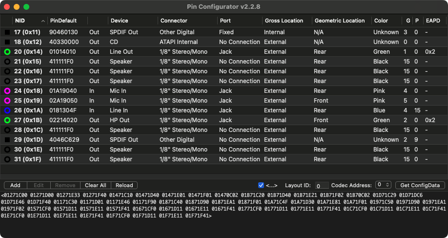

# PinConfigurator
HDA Audio Codec verb configuration application. See section `7.3.3.31 Configuration Default` of the [High Definition Audio Specification](https://www.intel.com/content/dam/www/public/us/en/documents/product-specifications/high-definition-audio-specification.pdf)

## About

The original [Pin Configurator](https://www.applelife.ru/threads/pin-configurator.18051/) was released back in 2009 by saxmms. The app crashes when running on 10.14.4 and the source was not available so I had to reverse it from the binary which took many hours of work. I've also re-written most of it and added some new features (see "Updates in v2+" section) but the original is by saxmms so big thanks to him.

## Purpose

- Parse pin configs from ConfigData, VoodooHDA and Linux, the program will determine the type of dump itself and select all the necessary ones 
- Add, delete and edit nodes 
- "Compile" a new ConfigData with a replaceable Codec address (the first digit of the configs pin) 
- Attempt to make ApplyFix
 
## Updates in v2+

- Added icon / support for Dark Mode / 64-bit
- Re-written Voodoo / Linux / ConfigData codec dump file parsing
- Added support for importing / exporting EAPD (70c) verbs
- Changed the "Apply Fix" method to work the same as verbit (thanks to Signal64 / THe KiNG)
- Create default node for "Headphone Mic Boost Volume" (insanelyDeepak)
- Added Import / Export PinConfigs.kext
- Added Import IORegistry pin configuration
- Added Import [HdaCodecDump.efi](https://github.com/acidanthera/OpenCorePkg/tree/master/Application/HdaCodecDump) format
- Added Export verbs.txt
- Added Export HdaCodec.txt (Linux-style codec dump format)
- Can open Clover r4887+ audio codec dumps (press F8 from Clover menu to dump to EFI/CLOVER/misc folder)
- Fixed HDA Audio spec issues (eg. Split location into gross / geometric values, made misc and EAPD bit fields)

## Instructions

- File->Open... your Voodoo, Linux or Config Data (Pin Configurator will detect format)
- Select Patch->Apply Verbit Fix menu to sanitize verb data
- Select File->Export->PinsConfig.kext to export your pin data to PinConfigs.kext/Contents/Info.plist
 
## What Patch->Apply Verbit Fix does now

- Fix "Headphone Mic Boost Volume" (insanelyDeepak)
- Remove 0x411111F0 / 0x400000F0
- Remove CD at INT ATAPI
- 0x71C: Index should always be 0
- 0x71C: Group should be unique
- 0x71D: Set all Misc to 0 (Jack Detect)
- 0x71F: Front Panel change Location from 2 to 1
- 0x71E: Line Out must be set to Speaker for Headphone autodetect to work correctly (Rodion2010)
- 0x71E / 0x71F: First Microphone Port set to Fixed / Location set to Internal, N/A and Connector set to Unknown (Enables DSP Noise Reduction - Rodion2010)
- 0x71E: Second Microphone Device set to Line In / Connector set to Unknown (Ext Mic doesn't work on Hackintoshes - Rodion2010)
- 0x71E: Remove if Device set to Digital Other Out (HDMI)
 
## Additional Information

The letters G and P (the last two columns) are Group (Default Association) and Position (Index, Sequence), i.e. group and device number of the group. 
Switch <Ignore disable devices> excludes from the list of nodes disabled at the level of "iron" (port = 4)

## Screenshot

## Credits
- saxmms for writing the original software on which this project is based
- [headkaze](https://github.com/headkaze) for reversing the software, updating and maintaining it
